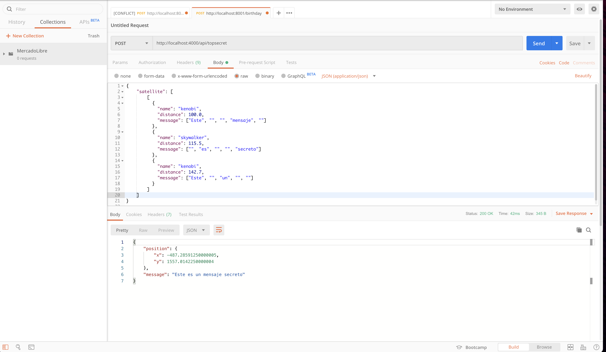
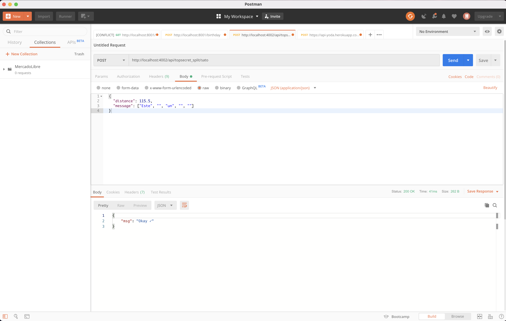
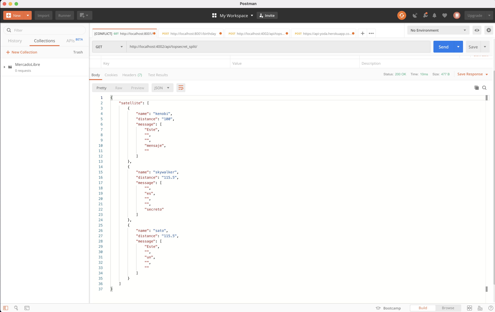
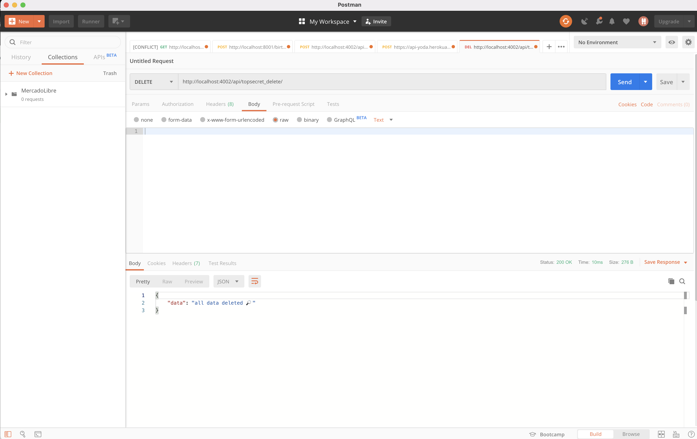

# ML Yoda 🚀

Description: Aplication web called "Yoda" in honor Yoda Jedi, to get the coordinates of imperial ship and decrypt the secret message

## Endpoint base

## `https://api-yoda.herokuapp.com/` 🟢

## Available Scripts

In the project directory, you can run this commands:

## Fist step, install the packages with `npm install` ⚙️

Run the project in local, you need to run the server to get data:

### `npm start dev` ⚙️

# Technologies 🛠

Node, Express, JavaScript, ES6, Mongoose, MongoAtlas

insert payload

[endpoint nivel 1](https://api-yoda.herokuapp.com/api/topsecret/) 📦

insert individual satellite

[insert satellite](https://api-yoda.herokuapp.com/api/topsecret/${satellite}) 📦

get all satellites inserted

[get all satellites like payload nivel 1](https://api-yoda.herokuapp.com/api/topsecret/) 📦

### `if you want to delete all satellites inserted in api/topsecret_split/{satellite}, you need use next endpoint` 📝

\*\*\* https://api-yoda.herokuapp.com/api/topsecret_delete/

# Continuous integration between github and heroku
